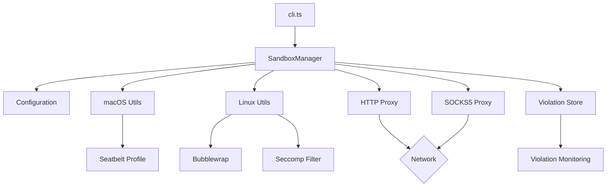

# Component Interactions and Data Flow

> Generated: 2024-11-06

## Overview
This document describes how different components interact with each other and how data flows through the sandbox-runtime system.

---

## High-Level Data Flow

```
User Command → CLI → SandboxManager → Platform Implementation → Sandboxed Process
                ↓                            ↓
          Configuration            Proxy Servers (HTTP/SOCKS)
                                            ↓
                                    Network Filtering
```

## Component Interaction Diagram



## Import Analysis

### Core Module Dependencies

#### CLI Layer (`src/cli.ts`)
```typescript
import { Command } from 'commander'
import { SandboxManager } from './sandbox/sandbox-manager.js'
import { loadConfig } from './sandbox/sandbox-config.js'
import { setDebug } from './utils/debug.js'
```

#### SandboxManager (`src/sandbox/sandbox-manager.ts`)
```typescript
import { spawn } from 'child_process'
import { createHttpProxy } from './http-proxy.js'
import { createSocksProxy } from './socks-proxy.js'
import { macOSSandbox } from './macos-sandbox-utils.js'
import { linuxSandbox } from './linux-sandbox-utils.js'
import { SandboxViolationStore } from './sandbox-violation-store.js'
import { getPlatform } from '../utils/platform.js'
```

#### Platform Implementations
```typescript
// macOS Implementation
import { exec, spawn } from 'child_process'
import { generateSeatbeltProfile } from './seatbelt-generator.js'
import { monitorViolations } from './violation-monitor.js'

// Linux Implementation
import { spawn } from 'child_process'
import { generateSeccompFilter } from './generate-seccomp-filter.js'
import { setupBubblewrap } from './bwrap-setup.js'
```

## Key Interaction Patterns

### 1. Command Execution Flow

```
1. User runs: srt [options] <command>
2. CLI parses arguments and loads config
3. SandboxManager.runCommand() called with:
   - Command array
   - Configuration object
   - Options (debug, settings path)
4. SandboxManager initializes:
   - HTTP proxy server
   - SOCKS5 proxy server
   - Violation store
5. Platform-specific sandbox applied:
   - macOS: sandbox-exec with Seatbelt
   - Linux: bubblewrap with seccomp
6. Command executed in sandbox
7. Cleanup on exit
```

### 2. Configuration Loading

```typescript
// Configuration flow
CLI.loadSettings(path)
  → readFileSync(settingsPath)
  → JSON.parse(content)
  → SandboxRuntimeConfigSchema.parse(json)
  → Validated configuration object
```

### 3. Proxy Initialization

```typescript
// HTTP Proxy setup
SandboxManager.initialize()
  → createHttpProxy(config)
    → net.createServer()
    → server.listen(port)
    → Returns proxy info

// SOCKS5 Proxy setup
SandboxManager.initialize()
  → createSocksProxy(config)
    → new SOCKS5Server()
    → server.listen(port)
    → Returns proxy info
```

### 4. Platform-Specific Execution

#### macOS Flow
```typescript
macOSSandbox(command, config)
  → generateSeatbeltProfile(config)
  → writeFileSync(tempProfile)
  → spawn('sandbox-exec', ['-f', profile, ...command])
  → monitorViolations(logStream)
  → cleanup(tempFiles)
```

#### Linux Flow
```typescript
linuxSandbox(command, config)
  → setupBindMounts(config.filesystem)
  → generateBwrapArgs(config)
  → setupNetworkBridge(proxyPorts)
  → spawn('bwrap', [...args, ...command])
  → applySeccompFilter(pid)
  → cleanup(sockets)
```

## Data Flow Patterns

### 1. Network Traffic Flow

```
Application Request
    ↓
Sandboxed Process
    ↓
[Restricted to proxy ports only]
    ↓
HTTP/SOCKS Proxy
    ↓
Domain Validation
    ├─ Allowed → Forward to destination
    └─ Denied → Block and log violation
```

### 2. Filesystem Access Flow

```
File Operation Request
    ↓
Sandbox Layer
    ↓
Permission Check
    ├─ Read Operation
    │   ├─ Allowed paths → Permit
    │   └─ Denied paths → Block
    └─ Write Operation
        ├─ Allowed paths → Permit
        └─ Other paths → Block
```

### 3. Violation Detection Flow

```
Sandbox Violation Occurs
    ↓
Platform Monitor
    ├─ macOS: Log stream parser
    └─ Linux: Post-execution check
    ↓
ViolationStore.addViolation()
    ↓
Store in memory
    ↓
Report on exit
```

## Message Passing and Events

### Process Events
```typescript
// Process lifecycle events
process.on('exit', () => SandboxManager.cleanup())
process.on('SIGINT', () => SandboxManager.cleanup())
process.on('SIGTERM', () => SandboxManager.cleanup())

// Child process events
child.on('exit', (code) => handleExit(code))
child.on('error', (error) => handleError(error))
```

### Proxy Events
```typescript
// HTTP Proxy events
httpServer.on('connect', handleConnect)
httpServer.on('request', handleRequest)
httpServer.on('error', handleError)

// SOCKS5 events
socksServer.on('connection', validateConnection)
socksServer.on('error', handleError)
```

### Stream Events
```typescript
// Violation monitoring (macOS)
logStream.on('data', parseViolation)
logStream.on('error', handleStreamError)
```

## Inter-Component Communication

### 1. Configuration Propagation
```
CLI → SandboxManager
    → HTTP Proxy (network config)
    → SOCKS Proxy (network config)
    → Platform Utils (filesystem config)
    → Violation Store (ignore patterns)
```

### 2. Proxy Port Communication
```
SandboxManager.initialize()
    → Returns { httpPort, socksPort }
    → Passed to platform utils
    → Embedded in Seatbelt/Bwrap config
    → Environment variables set
```

### 3. Violation Aggregation
```
Platform monitors → ViolationStore
    → addViolation(type, path/domain)
    → Deduplication
    → Summary generation
    → Final report
```

## Async Operation Patterns

### Parallel Initialization
```typescript
const [httpProxy, socksProxy] = await Promise.all([
  createHttpProxy(config),
  createSocksProxy(config)
])
```

### Sequential Cleanup
```typescript
async cleanup() {
  await httpProxy.close()
  await socksProxy.close()
  await removeTemporaryFiles()
}
```

### Stream Processing
```typescript
// Continuous violation monitoring
const monitor = spawn('log', ['stream'])
monitor.stdout.pipe(violationParser)
```

## Error Propagation

### Error Flow
```
Component Error
    ↓
Try-Catch Block
    ↓
Error Enhancement (add context)
    ↓
Propagate to caller
    ↓
CLI Error Handler
    ↓
User-friendly message
```

### Error Types
```typescript
// Configuration errors
ZodError → ValidationError → User message

// Runtime errors
SystemError → SandboxError → Exit code

// Network errors
ProxyError → NetworkError → Violation log
```

## State Management

### Global State
```typescript
// Module-level singleton
class SandboxManager {
  private static httpProxy?: HttpProxy
  private static socksProxy?: SocksProxy
  private static violationStore?: ViolationStore
}
```

### Configuration State
```typescript
// Immutable configuration
const config = Object.freeze(
  SandboxRuntimeConfigSchema.parse(input)
)
```

### Violation State
```typescript
// Append-only store
class ViolationStore {
  private violations: Violation[] = []

  addViolation(violation: Violation) {
    this.violations.push(violation)
  }
}
```

## Platform-Specific Interactions

### macOS Specifics
- **Seatbelt Profile**: Generated as text file
- **sandbox-exec**: System binary invocation
- **Log Stream**: Real-time violation monitoring
- **Regex Conversion**: Glob → Regex for paths

### Linux Specifics
- **Bubblewrap**: Containerization setup
- **Bind Mounts**: Filesystem mapping
- **Network Namespace**: Isolation setup
- **Unix Sockets**: Bridge via socat
- **Seccomp**: BPF filter application

## Performance Considerations

### Startup Sequence
1. Configuration parsing: ~5ms
2. Proxy initialization: ~100ms
3. Profile generation: ~10ms
4. Process spawn: ~50ms
5. Total overhead: ~165ms

### Runtime Impact
- Network latency: +10-20ms (proxy overhead)
- Filesystem checks: Negligible
- Violation monitoring: ~5% CPU (macOS)
- Memory usage: ~50MB (proxies)

## Security Boundaries

### Trust Boundaries
```
Untrusted Zone: Sandboxed process
    ↓ [Sandbox boundary]
Trusted Zone: Proxy servers
    ↓ [Network boundary]
External Network
```

### Privilege Levels
1. **User space**: CLI, configuration
2. **Sandbox space**: Restricted process
3. **System space**: sandbox-exec, bwrap
4. **Kernel space**: Seccomp filters